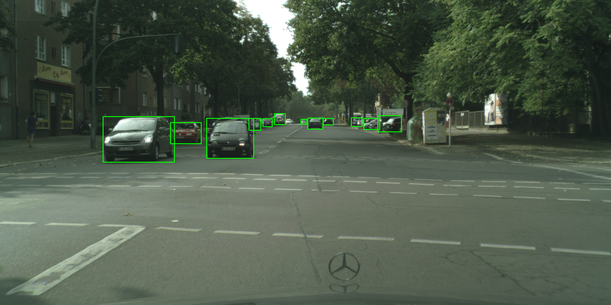

# 🔎  FCOS Pytorch

_A model implementing 2D object detection in images, trained on Cityscapes_

This is a pure Python 3.8 implementation of the Fully Convolutional One-Stage (FCOS) object detection algorithm.
There are some slight modifications from the original paper [FCOS: Fully Convolutional One-Stage Object Detection](https://arxiv.org/pdf/1904.01355.pdf).
This package will work with or without a cuda GPU. Without a GPU, you're going to be waiting a fair bit longer.


_For car detection on the Cityscapes val set, the model achieves an mAP of 0.48 after 70 epochs of training on Cityscapes train set. Average inference time is 20ms per image on an RTX 2070 super_.

## Quickstart
From zero to training in under 2 minutes (assumes you have `pyenv` installed with a working Python 3.8.1, and a local copy of the Cityscapes dataset).

```
pyenv local 3.8.1
pip install virtualenv
python -m virtualenv env
source env/bin/activate
pip install git+https://github.com/rosshemsley/fcos
fcos train --cityscapes-dir <path/to/cityscapes> -v
```

## Installing with pip
You can **pip install this package directly** if your pip is recent enough (20.1 is known to work).

```
pip install git+https://github.com/rosshemsley/fcos
```

## Installing locally
For local interation, consider checking out the repo and installing directly using poetry,
```
poetry install
```

To run the unit tests, you can use
```
poetry run pytest tests
```

## Training
Once you have installed the package, you can use the bundled CLI to train and test the network.
The following commands assume you have activated the environment containing the installed package.

To train the network, use
```
fcos train \
    --cityscapes-dir <path/to/Cityscapes> \
    --verbose
```

To track status using tensorboard, you can run
```
tensorboard --logdir runs
```

Models are written to the same directory as the tensorboard logs for now, the default is at `runs/`.

### Evaluating on the test set
To test inference on the Cityscapes test set.

```
fcos test \
    --cityscapes-dir <path/to/Cityscapes> \
    --model-checkpoint <path/to/checkpoint.chkpt> \
    --output ./output 
```

This will write predicted bounding boxes to all of the images in the test set into the output directory.

## Tips
This model was implemented using a newer version of Python than most OS's come shipped with.
The best way to get a modern Python install is to use `pyenv` and to set up a local version of Python.
First, install pyenv (and add the shim to your bashrc, or equivalent). You can then run

```
pyenv local 3.8
```

in your working directory so that future calls to `python` will use Python 3.8.